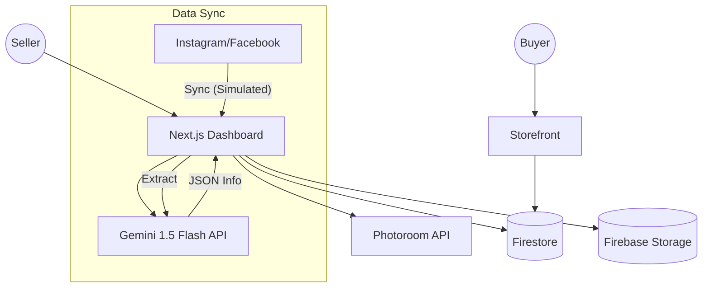

# How Postcart Works 🚀

Postcart is an AI-powered social commerce platform that turns social media posts into a professional storefront in seconds.

## 🏗️ Architecture Overview

The application is built with a modern stack focusing on real-time updates and AI integration.

## 🛠️ Technology Stack

| Component | Technology |
| :--- | :--- |
| **Framework** | Next.js 15+ (App Router) |
| **Frontend Logic** | React 19 (Hooks, Context) |
| **Database** | Firebase Firestore (Real-time NoSQL) |
| **Authentication** | Firebase Auth |
| **Storage** | Firebase Storage (Images) |
| **AI Extraction** | Google Gemini 1.5 Flash |
| **Image Magic** | Photoroom AI (Studio White background) |
| **Styling** | Vanilla CSS + Inline Styles |

## ✨ Key Features

### 1. AI Product Extraction
Postcart uses **Gemini 1.5 Flash** to scan social media captions. It automatically identifies:
- Product Names
- Prices (handles TSh, 'k', and '-/' notation)
- Professional descriptions

### 2. Magic Studio ✨
Integrated with the **Photoroom API**, sellers can remove messy backgrounds from their social photos and replace them with a clean, professional studio-white background with a single click.

### 3. Real-time Dashboard
The dashboard uses Firebase's `onSnapshot` to provide real-time updates. When a seller adds a product or changes a setting, the buyer's storefront updates instantly without a refresh.

### 4. Multi-Tenancy & Data Isolation
The backend is now truly **solid** and production-ready. 
- **Isolated Data**: Every seller's data (products, orders, settings) is stored in a unique document in Firestore named after their Firebase Auth `uid`.
- **Private Stores**: Store URLs are dynamic (e.g., `/store/[uid]`), ensuring no data overlap between different sellers.
- **Scoped Checkout**: The shopping cart and checkout process are scoped to the specific seller, preventing cross-store cart issues.

### 5. Smart Seeding
To ensure a smooth onboarding experience, the app automatically seeds the Firestore database from a local `products_db.json` whenever a **new** seller accesses their dashboard for the first time.

1. **Connect**: Seller connects "Sync Social" (Simulated).
2. **Scan**: Postcart pulls posts (Image + Caption).
3. **Extract**: Gemini AI parses the caption into a structured JSON product.
4. **Refine**: Seller reviews and clicks "Complete Import".
5. **Sync**: Data is saved to Firestore and images to Firebase Storage.
6. **Live**: The storefront (e.g., `/store/my-social-shop`) fetches this data in real-time for buyers.

---

> [!NOTE]
> For setup instructions, please refer to the [README.md](./README.md).
